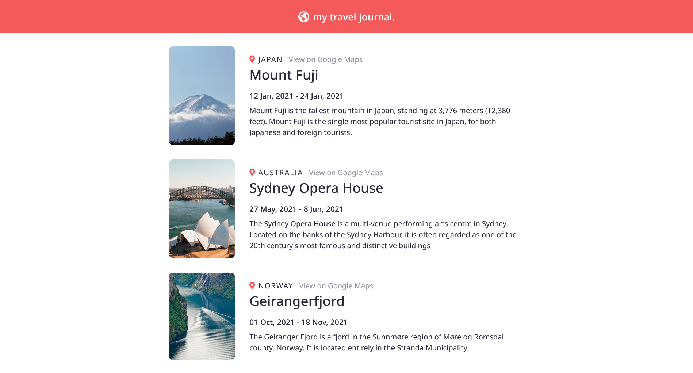
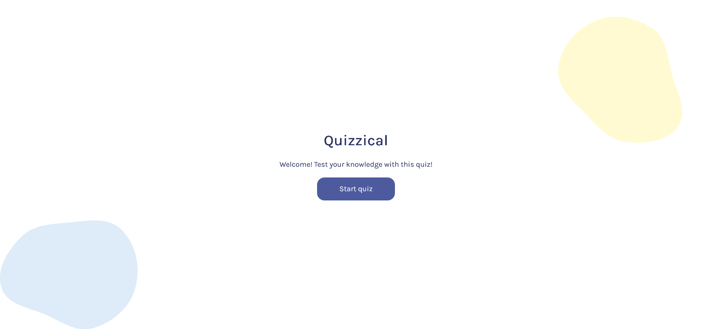

# Scrimba React Solo Projects
 My solutions to the solo projects of Scrimba's React course.

 Scrimba's React course links:
 - [Scrimba's scrims](https://scrimba.com/learn/learnreact)
 - [freeCodeCamp's YouTube channel](https://www.youtube.com/watch?v=bMknfKXIFA8)

All these projects are built with Vite + React.

## Digital Business Card

- [Live site](https://helenchong.dev/Scrimba-React-Solo-Projects/1-digital-business-card/)
- [Source code](https://github.com/helenclx/Scrimba-React-Solo-Projects/tree/main/1-digital-business-card)

## Travel Journal

- [Live site](https://helenchong.dev/Scrimba-React-Solo-Projects/2-travel-journal/)
- [Source code](https://github.com/helenclx/Scrimba-React-Solo-Projects/tree/main/2-travel-journal)

## Quizzical

- [Live site](https://helenchong.dev/Scrimba-React-Solo-Projects/3-quizzical/)
- [Source code](https://github.com/helenclx/Scrimba-React-Solo-Projects/tree/main/3-quizzical)